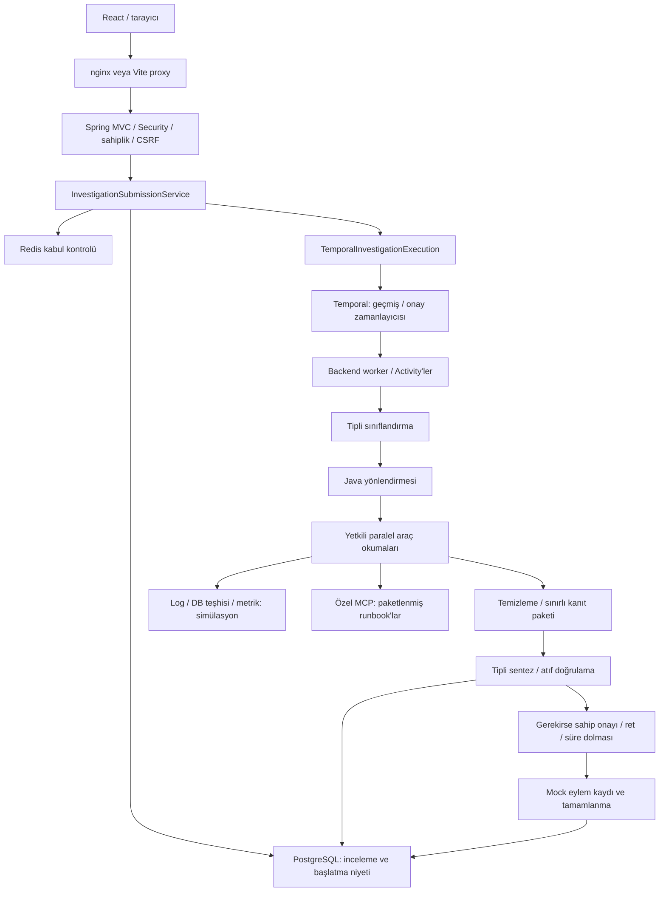

# AI Incident Orchestrator — mimari haritası

Kaynak incelemesi: **2026-10-08**. Bu dosya mevcut sistemi özetler; ayrıntılı yaşayan bağlam [PROJECT_CONTEXT.md](../PROJECT_CONTEXT.md), tarihli kontroller [STATE.md](STATE.md) içindedir. Çalıştırılabilir kod ve yapılandırma doğruluk kaynağıdır. Bu görev yalnızca dokümantasyon değiştirir.

## Depo ve bileşenler

| Konum | Sorumluluk |
| --- | --- |
| [backend/pom.xml](../../backend/pom.xml), `backend/src/main/java/dev/orchestrationlab/incident/` | Java 25 / Spring Boot 4.1.1 MVC uygulaması ve aynı süreçte Temporal worker. Security/OIDC, JPA/Flyway, Redis, Actuator, Spring AI 2.0.1, Temporal SDK 1.40.0. |
| `authentication/`, `user/`, `configuration/SecurityConfiguration.java` | Google OIDC adaptörü, dahili kullanıcı UUID'si, HttpSession, CSRF, güvenli profil DTO'su. |
| `investigation/` | Sahiplik kontrollü API, kayıtlar, kısa transaction'lar, durum/onay, başlatma niyeti, denetim ve mock eylem kaydı. |
| `orchestration/`, `reasoning/`, `context/`, `tool/` | Tipli anlamsal çıktı, Java yönlendirmesi, sınırlı paralel kanıt toplama, temizleme/bütçe, kaynaklı sentez ve yetkili araç çağrısı. |
| `workflow/` | Deterministik workflow, dış işleri yürüten Activity'ler, kalıcı onay/zamanlayıcı, başlatma dispatcher'ı. |
| `observability/`, izleme yapılandırması | Micrometer/OTel gözlemleri ve Temporal bağlam aktarımı. |
| [frontend/package.json](../../frontend/package.json), `frontend/src/` | React 19 / TypeScript 7 / Vite 8; oturum, inceleme oluşturma/durum sorgulama/onay/ret arayüzü. |
| [mcp/documentation-server](../../mcp/documentation-server/pom.xml) | Bağımsız Spring Boot + Spring AI MVC MCP sunucusu; iki paketlenmiş runbook. |
| `backend/src/main/resources/db/migration/` | Flyway V1–V6: kullanıcı, inceleme, JSONB kanıt/rapor, onay, kalıcı başlatma, eylem ve denetim. Hibernate `validate` kullanır. |
| `backend/src/test/`, `mcp/documentation-server/src/test/`, `docs/` | Testler; ayrıntılı rehberler ve tarihsel checkpoint kayıtları. Eski planlar güncel uygulama sözleşmesi değildir. |

## İstek ve yürütme akışı

Kaynaklar: `InvestigationSubmissionService`, `TemporalInvestigationExecution`, `InvestigationWorkflowImpl`, `InvestigationActivitiesImpl`, `EvidenceCollector`, `InvestigationStateService`. `temporal` kapalıysa `IncidentOrchestrator` senkron yürütür; oluşturma CREATED kaydeder, açık `/run` gerekir ve kalıcı onay zamanlayıcısı yoktur.

Durumlar: CREATED → ANALYZING → COLLECTING_EVIDENCE → REASONING → COMPLETED veya WAITING_APPROVAL → COMPLETED; hata FAILED olabilir. Rapor onay beklemeden önce saklanır. Workflow deterministiktir; model/ağ/veritabanı işleri Activity'lerde kalır. Kuyruk `incident-investigations-v1`, namespace `default`, workflow kimliği `investigation-<UUID>`; onay varsayılan bir saat, Activity en fazla üç denemedir.

## LLM ve araç yetkileri

- `ReasoningConfiguration`: `ai` profilinde `SpringAiIncidentReasoningModel` / OpenAI ChatModel; diğer durumda mevcut `FakeIncidentReasoningModel`. Çalışan container'da `ai` etkin değildir.
- Sınıflandırma ve sentez sürümlü prompt, yapılandırılmış çıktı ve Java doğrulaması kullanır. Model önerir; Java kaynak seçimi, sahiplik, durum ve eylem politikasını uygular.
- `ToolExecutionService`: LOGS, DATABASE, METRICS, DOCUMENTATION; sahiplik ve izinli araç kontrolü, tipli `ToolInput(service,topic,limit)`, süre/çıktı sınırları. Serbest SQL, kabuk, kullanıcı/model tarafından seçilen HTTP hedefi yoktur.
- `SpringAiTools` callback'leri `searchLogs`, `queryDatabase`, `inspectMetrics`, `searchDocumentation` adlarını sunar. Ayrı `reason(question, ToolSession)` gösterimi dört model turu ve sekiz araç çağrısıyla sınırlıdır; kalıcı inceleme akışı bu döngüyü çağırmaz.
- `EvidenceCollector` şu anda hedefi sabit `recommendation`, topic'i ERRORS, limit'i 4 seçer. Kaynak yönlendirmesi gerçek olsa da olaydan servis hedefi çıkarımı uygulanmamıştır.
- `ContextBuilder` varsayılan olarak dört araç, 12 kanıt, kaynak başına 2000 ve toplam 8000 özet karakteri sınırlar. Bu karakter bütçesidir; token garantisi değildir. Sentez atıfları paketteki kimliklere karşı doğrulanır.
- Onaylanan tek eylem `RESTART_RECOMMENDATION_SERVICE` için benzersiz veritabanı kaydıdır; gerçek restart yapılmaz. Mevcut bütünleşik raporlar `diagnosticSourcesSimulated=true` taşır.

## Docker servisleri

Kaynaklar: [compose.yaml](../../compose.yaml), modül Dockerfile'ları ve [nginx.conf](../../frontend/nginx.conf).

| Servis | Erişim / veri | Sağlık / bağımlılık |
| --- | --- | --- |
| frontend | Host `127.0.0.1:5173` → nginx 8080 | `/`; sağlıklı backend bekler. |
| backend | Özel ağda 8080; worker aynı süreçte | Readiness; PG/Redis/Temporal/MCP sağlıklı olmalı. |
| documentation-mcp-server | Özel ağda 8081, Streamable HTTP `/mcp` | Actuator health; host portu yayınlanmaz. |
| postgres | PostgreSQL 18; host loopback 5432; `postgres_data` | `pg_isready`; gerçek uygulama verisi. |
| redis | Redis 8; host loopback 6379 | Parolalı PONG; RDB/AOF kapalı, geçici kabul pencereleri. |
| temporal | `temporalio/temporal:1.9.1 start-dev`; loopback 7233/8233; `temporal_data` | Cluster health; SQLite üzerinde yerel geçmiş. |

Compose varsayılan backend profilleri `container,temporal,mcp`; canlı model ve Google için ayrıca `ai` / `google` ve geçerli kimlik bilgileri gerekir. `AI_CHAT_MODEL` Compose varsayılanı `offline-fixture` canlı model seçimi değildir. `.env` Compose tarafından okunur; Maven/IDE otomatik okumaz. Sırlar Git ve Docker build context dışında tutulur.

Java image'ları çok aşamalı build ve root olmayan UID 10001 kullanır; frontend Node 24/npm 12 ile derlenip yetkisiz nginx'te sunulur. Java Docker build'leri testleri atlar; ayrı test doğrulaması gerekir. Bu Compose yerel HTTP/geliştirme ortamıdır; production TLS, HA veya üretim Temporal kurulumu sağlamaz.

## Entegrasyonların gerçeklik sınırı

| Entegrasyon | Uygulanan gerçek davranış | Sınır |
| --- | --- | --- |
| PostgreSQL/Flyway/JPA | Kalıcı kayıt, migration, sahiplik ve idempotent mock eylem kaydı | DATABASE teşhis aracı bundan bağımsız simülasyondur. |
| Redis | Atomik Lua ile create/run kabul kontrolü; arızada 503 | Oturum veya kalıcı workflow deposu değildir. |
| Temporal | Gerçek yerel servis ve Java worker; standart testlerde TestWorkflowEnvironment | Yerel `start-dev`; bu görevde canlı workflow/restart smoke'u yapılmadı. |
| MCP | Resmî istemciyle initialize/listTools/callTool; sabit yetenek | Paketlenmiş eğitim runbook'ları; canlı dokümantasyon araması değildir. |
| OpenAI | Spring AI canlı adaptörü uygulanmış | Çalışan backend'de anahtar yok ve profil kapalı; sağlayıcı çağrısı doğrulanmadı. |
| Google OIDC | Framework akışı ve kullanıcı sağlama uygulanmış | Çalışan backend'de kimlik bilgileri yok ve profil kapalı; gerçek giriş doğrulanmadı. |
| Log/metrik/DB teşhisi | Tipli araç politikası ve sınırlı okumalar | `StubEvidenceAdapter` sabit SIMULATED çıktısı üretir. |
| İyileştirme | Sahip onayı ve tekrar güvenli mock kayıt | Uzak yan etki veya gerçek operasyon API'si yoktur. |
| Telemetri | Micrometer, Spring AI, OTel, Temporal enstrümantasyonu | Compose'da collector/dashboard/alarm yok; canlı aktarım doğrulanmadı. |

## Güvenlik ve mevcut açıklar

Google OIDC → dahili UUID → sunucu HttpSession; aynı origin çerez/CSRF akışı ve inceleme sahibine göre sorgular korunur. API'ler rastgele araç yetkisi vermez. MCP tarayıcı Origin isteklerini 403 ile reddeder; bu, kimlik doğrulamanın yerine geçmez. MCP auth/TLS ve production secure-cookie yapılandırması mevcut yerel dağıtımda yoktur.

Readiness yalnızca veritabanını kapsar. Başlatma dispatcher'ı 12 denemeden sonra sessizce tükenebilir; Temporal geçmişi ve PostgreSQL görünümü için otomatik uzlaştırma yoktur. Sayfa yenilemede seçili inceleme kaybolur; liste/geçmiş arayüzü yoktur. Maskeleme eksiksiz değildir; soru ve temizlenmiş kanıt hassas olabilir. Saklama/silme politikası, kalıcı token/maliyet defteri, üretim workflow sürümleme ve yedekleme açık çalışmalardır. Uzun süreli model belleği ve çok ajanlı runtime uygulanmamıştır.
